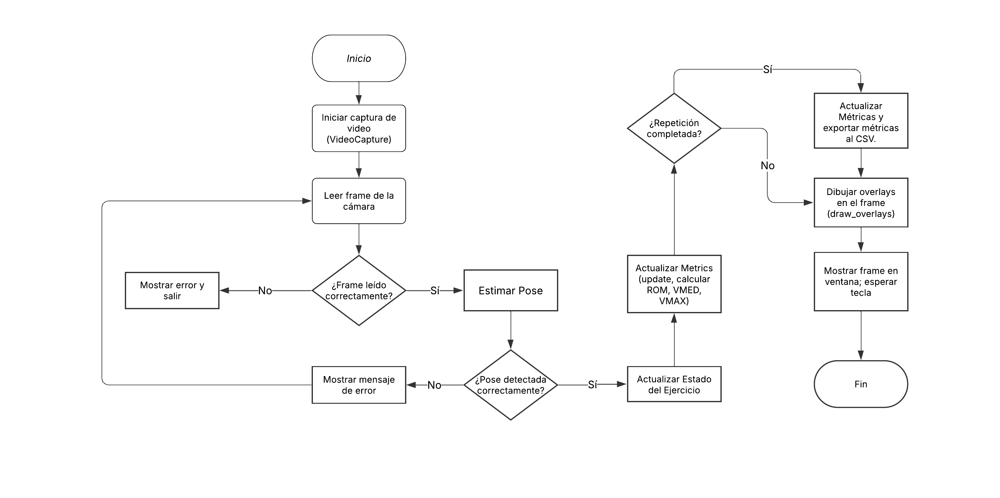

# Proyecto: Análisis de Movimiento en Ejercicios mediante Visión por Computadora

AI Trainer – Virtual Gym utiliza un modelo de IA (YOLO) para la estimación de pose en tiempo real, calcula métricas biomecánicas (ROM, VMED, VMAX) y exporta los resultados para su seguimiento.


## Características principales

Características Principales
Detección de pose mediante YOLO.
Análisis de ejercicios con una clase base Exercise y subclases específicas (CurlExercise, SquatExercise, etc.).
Cálculo de métricas biomecánicas (ROM, VMED, VMAX).
Visualización de Overlays (barras de progreso, contadores) en tiempo real.
Exportación de datos en formato CSV para un análisis posterior.
#### Clonar el proyecto

```bash
  git clone https://github.com/amcdvg/Ejercicios_wimspro.git
```

## Referencias Bibliográficas
Trotter, M. R., & Gleser, G. C. (1952).
Estimation of stature from long bone measurements. American Journal of Physical Anthropology, 10, 200–317.
Link a la referencia (PubMed)

Duyar, I., & Pelin, C. (2003).
Body height estimation based on tibia length in different stature groups. American Journal of Physical Anthropology, 122, 23–27.
Acceso al artículo

Gul, H., Nizami, S. M., & Khan, M. A. (2020).
Estimation of height of an individual from forearm length in medical students. Cureus, 12(1), e6599.
doi:10.7759/cureus.6599

Joshi, A., et al. (2024).
[Estudio sobre la relación entre la longitud del antebrazo y la estatura].
(Referencia utilizada para la estimación del antebrazo; consultar archivo en Drive)

Sayers, S. P., et al. (2008).
Biomechanical analysis of resistance exercise: velocity and power output during biceps curls.
Journal of Strength and Conditioning Research.
(Para información sobre velocidades en movimientos de curl).

Puedes descargar y consultar los artículos completos desde el siguiente enlace en Drive:
[Documentos de Referencias](https://drive.google.com/drive/folders/17ASj1-250q9EJwoOWLLMcB6Cnxq1e9R8?usp=drive_link)

Esta sección recopila las fuentes utilizadas para fundamentar los modelos de regresión (para la tibia y el antebrazo) y los rangos esperados de las métricas (ROM, VMED, VMAX). Puedes ajustar o ampliar la lista según se vayan integrando nuevos estudios o referencias relevantes.

## Diagrama de flujo 
Aquí se describe el diagrama de flujo principal...



## Estructura del proyecto

```bash
ai-trainer-virtual-gym/
│
├── docs/
│   ├── flow_diagram.png
│   ├── high_level_diagram.png
│   ├── uml_classes.png
│   └── Documentation_Complete.docx  # Documento Word con la documentación extensa
│
├── exercises/
│   ├── base.py
│   ├── curl.py
│   ├── squat.py
│   ├── pushup.py
│   └── plank.py
│
├── utils/
│   ├── _utils.py
│   ├── drawing.py
│   ├── visors.py
│   ├── metrics.py
│   ├── anthropometry.py
│   └── csv_exporter.py
│
├── pose_estimator.py
├── constants.py
├── logging_config.py
├── main.py
├── requirements.txt
└── README.md
```

## Dependencias 
Una vez que se haya clonado el proyecto en su equipo local, se procederá a instalar las dependencia, por tanto se creará un entorno vistual para ello

#### Entorno virtual 
* Windows 

```bash
  
  python -m venv nombre_del_entorno
  
```
 - Activar del entorno 

    ```bash
    
       nombre_del_entorno\Scripts\activate
    
    ```
 - Desactivar el entorno virtual

    ```bash
    
       deactivate

    
    ```
* IOS

```bash
  
  python3 -m venv nombre_del_entorno

  
```
 - Activar del entorno 

    ```bash
    
       source nombre_del_entorno/bin/activate

    ```
 - Desactivar el entorno virtual

    ```bash
    
       deactivate
    
    ```
#### Instalación de dependencias
Una vez que tenga activado el entorno virtual, se ejecutará el  siguiente comando 

```bash
  pip install -r requirements.txt
```

## Ejecución del script

Desdde una terminal, teniendo el entorno virtual activado, se procederá a ejecutar el siguiente comando

```bash
  python main.py
```
